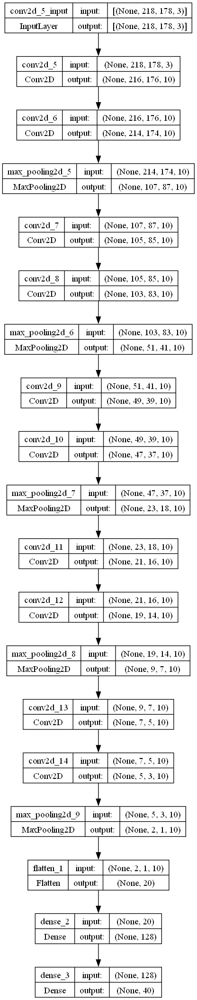
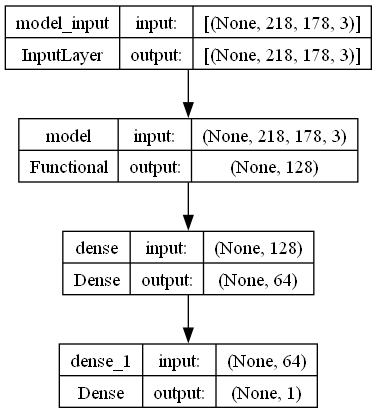

# Reporte
Para este trabajo, seguí el procedimiento recomendado. Primero, creé una red que identificara las facciones faciales de los famosos en la librería CelebA con alrededor de 50000 de estos datos. La red construida tenía la siguiente forma,

Todas son capas convolucionales 2D con activación relu. Después, aplano y las meto en dos capas densas. La primera con activación relu y la última con sigmoide.

Posteriormente, guardé la red en un archivo hdf5 para después cargarlo, eliminarle la última capa y agregarle otras dos densas para la clasificación de reconocimiento de mi cara.

Para las imágenes de mi cara, agarré 1000 imágenes de CelebA no vistas por la primera red. Después, conseguí alrededor de 35 fotos mías y las aumenté 30 veces con imágenes reflejadas vertical y horizontalmente.
Con esta red conseguí una precisión del $\approx 98\%$, por lo que no consideré necesario crear otras redes. No obstante, creo que es posible que este número esté ligeramente inflado por tantas imágenes aumentadas.